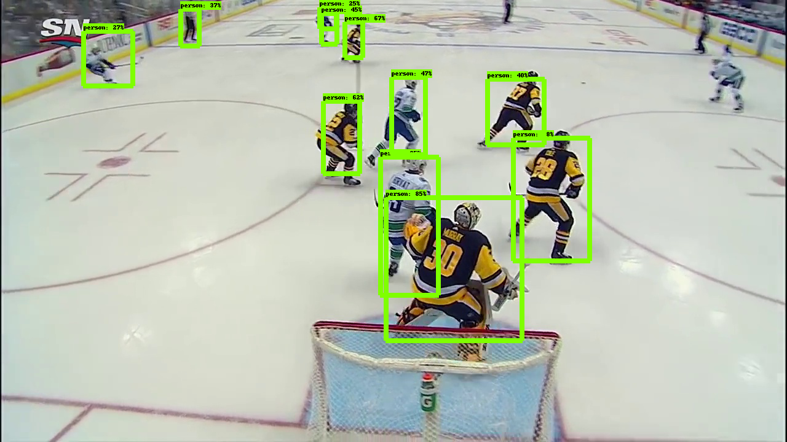
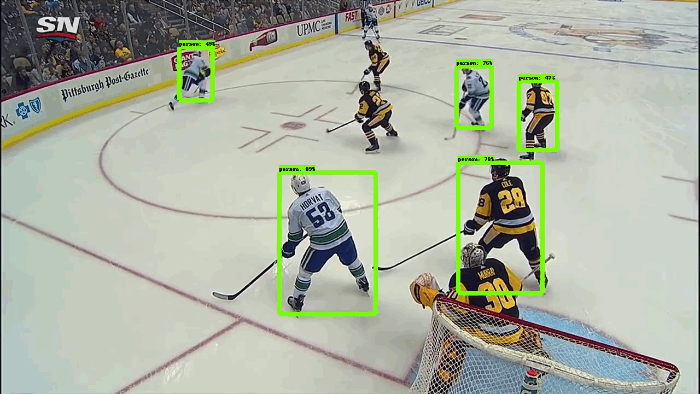

# CanucksObjectDetection

I used the TensorFlow Object Detection API to apply a pre-trained model on ice hockey footage from my favorite team, the Vancouver Canucks. I wanted to see if the pre-trained 'person' class based on the COCO dataset could be used to detect the positions of hockey players on the ice.

I did this by modifying the [Object Detection Tutorial jupyter notebook][1] to only output overlays of the 'person' class ('skis' was the second most commonly identified class) and also lower the detection threshold from 0.5 to 0.25.

Inference from detection on still images was mixed (see [example](example_outputs_blue) [outputs](example_outputs_white)).

However, inference from detection on videos worked pretty well at lower thresholds. There's still noise where multiple 'persons' are detected for the same player, and certain poses (e.g., the goalie going into butterly) make the model fail, but certainly for the whole scene players are fairly detectable.

[1]: object_detection_tutorial_modified.ipynb